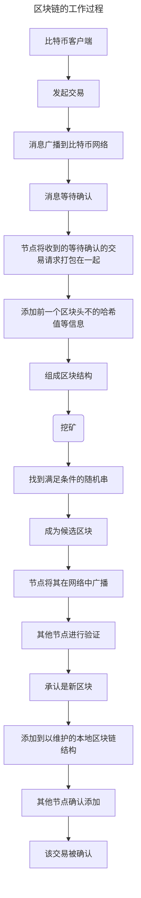
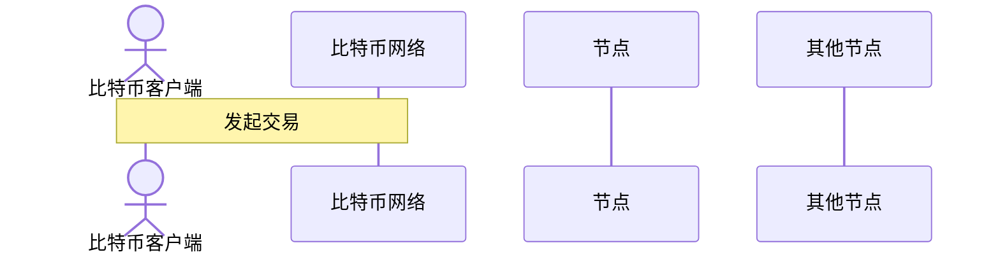

# 区块链技术原理

### [P1-区块链介绍](./src/main/java/com/sozcos/p1/P1-what_is_blockchain.md)

---

**相关资料:**  
[博客园——区块链技术原理](https://www.cnblogs.com/davidzhu/p/16396812.html)  
[区块链技术指南](https://yeasy.gitbook.io/blockchain_guide/)

