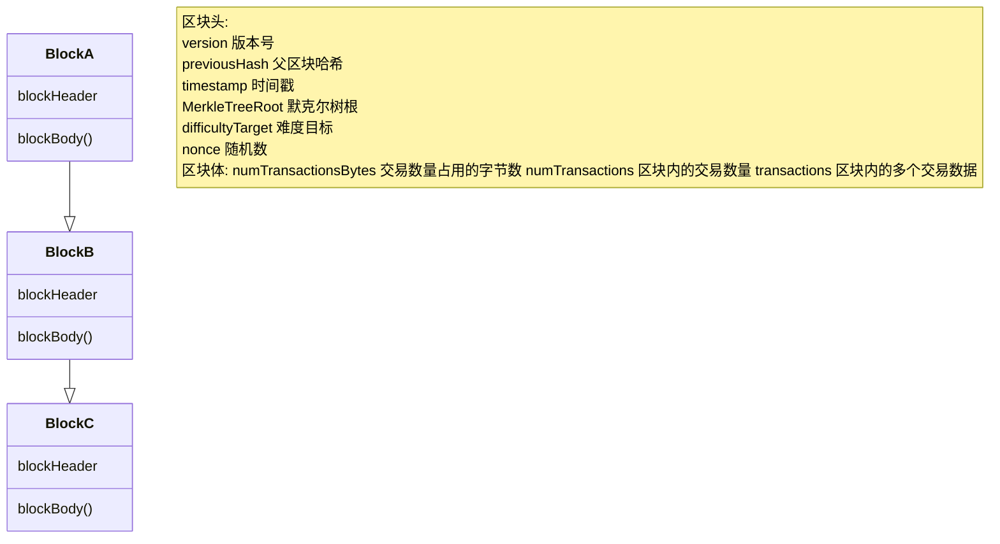
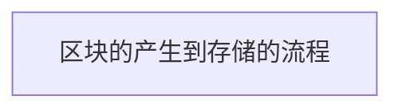

P1 区块链介绍
---

### 本章目标:

> 1. 明白区块链是什么
> 2. 理解区块链的组件以及实现原理
> 3. 了解区块链的商业以及应用价值
> 4. 代码实现区块链

**相关资料:**  
[区块构成详解](https://zhuanlan.zhihu.com/p/48329978)  
[区块链的定义以及原理](https://yeasy.gitbook.io/blockchain_guide/02_overview/definition)  
[比特币交易数据结构解析](https://www.cnblogs.com/itlgl/p/10419307.html)

---

### 1. 区块链是什么

**1.1 定义:**

> 区块链是一种分布式数据存储技术

这是对区块链最简单的一种理解, 既然是数据, 并且是分布式的去中心化的, 那么就涉及了一些列的算法以及技术来防止数据被纂改.

---

**1.2 区块链的基本原理:**

区块链的基本原理理解起来并不复杂。首先来看三个基本概念：
> 交易（Transaction）：一次对账本的操作，导致账本状态的一次改变，如添加一条转账记录；   
> 区块（Block）：记录一段时间内发生的所有交易和状态结果等，是对当前账本状态的一次共识；   
> 链（Chain）：由区块按照发生顺序串联而成，是整个账本状态变化的日志记录。

如果把区块链系统作为一个状态机，则每次交易意味着一次状态改变；生成的区块，就是参与者对其中交易导致状态改变结果的共识。  
区块链的目标是实现一个分布的数据记录账本，这个账本只允许添加、不允许删除。账本底层的基本结构是一个线性的链表。链表由一个个“区块”串联组成（如下图所示），\
后继区块中记录前导区块的哈希（Hash）值。某个区块（以及块里的交易）是否合法，可通过计算哈希值的方式进行快速检验。网络中节点可以提议添加一个新的区块，但必须经过共识机制来对区块达成确认

---

**1.3 查询区块交易信息**

假设你已经会使用数字货币进行交易, 那么如何查询以及看懂这笔交易数据的内容呢?

这里以 MetaMask 钱包为例 ( **传送门** >>> [_使用 MetaMask
钱包获取测试币进行数字货币交易_](https://github.com/inoutcode/ethereum_book/blob/master/%E7%AC%AC%E4%BA%8C%E7%AB%A0.asciidoc#%E5%AE%89%E8%A3%85-metamask)
**注:**_测试币网络随着时间跟文章有所出入,需要自行搜索添加测试币教程_ )

可以通过复制交易ID获取直接跳转到浏览器查看交易的区块信息

---

**1.4 区块存储的信息:**

> 区块存储的信息分为2个部分, 一部分是区块头, 一部分是区块体, 以下我们采用比特币区块信息来阐述

通过 [比特币浏览器](https://btc.tokenview.io/cn?_gl=1%2a9lkioz%2a_ga%2aMjQ4Nzc1MjM0LjE2OTgzMTAwMzA.%2a_ga_0RCPHZPZTE%2aMTY5ODM5NjgyOS4zLjEuMTY5ODM5Njg2OC4wLjAuMA..)
查看区块信息

区块的高度就是区块在链中所排列的位置,也可以理解成索引,可以通过区块高度以及区块哈希来查询区块信息

通过API获取区块和交易数据: [Block Json](https://api.blockcypher.com/v1/btc/main/blocks/00000000000000000004727b3cc0946dc2054f59e362369e0437325c0a992efb) / [Txs Json](https://api.blockcypher.com/v1/btc/main/txs/ab70327f9e8e79ac6c3745df45a7c6af7d04647846e054839054355890f74688?limit=50&includeHex=true)

 
    
区块数据:

    <pre><code>{
  "hash": "00000000000000000004727b3cc0946dc2054f59e362369e0437325c0a992efb",
  "height": 814037,
  "chain": "BTC.main",
  "total": 193017057174,
  "fees": 9915912,
  "size": 1635501,
  "vsize": 999039,
  "ver": 551550976,
  "time": "2023-10-27T08:55:06Z",
  "received_time": "2023-10-27T08:55:27.246Z",
  "relayed_by": "54.235.161.238:8333",
  "bits": 386178217,
  "nonce": 4079513189,
  "n_tx": 2003,
  "prev_block": "0000000000000000000286cf768b68e905dee3c80c20b0b4cb895e3cb9e61357",
  "mrkl_root": "5d0dae31db7c93f59ba2c595acc64eaf0d78ef07616bc31f091f4b696dd5d9fa",
  "txids": [
    "ab70327f9e8e79ac6c3745df45a7c6af7d04647846e054839054355890f74688",
    "a16f505d3cc1afbf382d0d72109dc44eaa5eed5cb05b23bf29c77739bd9aefd1",
    "da4faf29bbfaf6852f6a44831927f1dc75cf2775b3d3d8a5794443015473e843",
    "386f62f12094db0170ac96b01a6d9f77d84b9ee72e5e79b585dd214c29a94a12",
    "b86ec5655b9a2b5fcaae760edce63c1aeda6b6206714341bea5ea3e47bfc35cb",
    "b3a0410b71ed7f03babd5f1b02e5f38ca6edaaf31e973f93888bd40c13593c51",
    "f803bc50ae26afc7d9c78897f902c7edf781121fcb1c42d6db265154995e998b",
    "162983f79edc6d69cf728550ac1cf2556e73a6eb389592fb46c21042b705d35f",
    "00f542fb380c7b1215039f7191ac65216445d2b20104d20c9f51c016f140f928",
    "a9a14968ea0147cdd73774b6b12b2786cb9205fae3cbf51df6ef0122fa044cc4",
    "f7d3b73c78413615138696af617c6e7dc14426cb04b95208a33468758ab14b8c",
    "f3cd96fae3721fabf9e8a143da7fe04a58a94b94b1f2705389da4e18ce3a1b64",
    "fda27e4bd8073e723646ffa101a5c04c0d23c6f88b14bde6943ccd92ee7f926b",
    "d5d12b5d654c5c229f6b539d344ded4865c5e554e386664ac06af21c670b1fd7",
    "f7996882b763653eac54b76b14ea59ee30867117e8dd4fc9dec0db8a411ed951",
    "3657e5ab966baff1df47b1a8190800bea5677de39091cfc007c4e5ee7ca78017",
    "123a8a83d45daf56834b96b2d2832cab64115d3b19eacf9ce68d36865349f8a3",
    "78d49f0c320a0f93930f46d500c4841c163190a6a28c545031c857ea3dbcf857",
    "b60d3391bd27b18ebbf131e8c2ab96866b543cda3d7cefbfe3f895c722c96373",
    "86e9d5c8f8d2747c57144f2ac427fee564f8f8a9d3e146e6b8204bc002aad7b2"
  ],
  "depth": 0,
  "prev_block_url": "https://api.blockcypher.com/v1/btc/main/blocks/0000000000000000000286cf768b68e905dee3c80c20b0b4cb895e3cb9e61357",
  "tx_url": "https://api.blockcypher.com/v1/btc/main/txs/",
  "next_txids": "https://api.blockcypher.com/v1/btc/main/blocks/00000000000000000004727b3cc0946dc2054f59e362369e0437325c0a992efb?txstart=20\u0026limit=20"
}</code></pre> 

 
    
交易数据:

    <pre><code>{
  "block_hash": "00000000000000000004727b3cc0946dc2054f59e362369e0437325c0a992efb",
  "block_height": 814037,
  "block_index": 0,
  "hash": "ab70327f9e8e79ac6c3745df45a7c6af7d04647846e054839054355890f74688",
  "hex": "020000000001010000000000000000000000000000000000000000000000000000000000000000ffffffff3103d56b0c04ea7a3b652f466f756e6472792055534120506f6f6c202364726f70676f6c642f1cb909e12007020000000000ffffffff02480cd8250000000016001435f6de260c9f3bdee47524c473a6016c0c055cb90000000000000000266a24aa21a9edccb97dd75664f7ec78c6f9c7dc66010a9653a03c1a44ba7374d8bec6e2d509c90120000000000000000000000000000000000000000000000000000000000000000000000000",
  "addresses": [
    "bc1qxhmdufsvnuaaaer4ynz88fspdsxq2h9e9cetdj"
  ],
  "total": 634915912,
  "fees": 0,
  "size": 214,
  "vsize": 187,
  "preference": "low",
  "confirmed": "2023-10-27T08:55:27.24638704Z",
  "received": "2023-10-27T08:55:27.24638704Z",
  "ver": 2,
  "double_spend": false,
  "vin_sz": 1,
  "vout_sz": 2,
  "data_protocol": "unknown",
  "confirmations": 43,
  "confidence": 1,
  "inputs": [
    {
      "output_index": -1,
      "script": "03d56b0c04ea7a3b652f466f756e6472792055534120506f6f6c202364726f70676f6c642f1cb909e12007020000000000",
      "output_value": 625000000,
      "sequence": 4294967295,
      "script_type": "empty",
      "age": 814037
    }
  ],
  "outputs": [
    {
      "value": 634915912,
      "script": "001435f6de260c9f3bdee47524c473a6016c0c055cb9",
      "addresses": [
        "bc1qxhmdufsvnuaaaer4ynz88fspdsxq2h9e9cetdj"
      ],
      "script_type": "pay-to-witness-pubkey-hash"
    },
    {
      "value": 0,
      "script": "6a24aa21a9edccb97dd75664f7ec78c6f9c7dc66010a9653a03c1a44ba7374d8bec6e2d509c9",
      "addresses": null,
      "script_type": "null-data",
      "data_hex": "aa21a9edccb97dd75664f7ec78c6f9c7dc66010a9653a03c1a44ba7374d8bec6e2d509c9"
    }
  ]
}</code></pre> 

---

**1.5 区块参数解析:**
> 一个区块包含了2哥部分的信息: 区块头, 区块体, 区块头主要记录区块自身信息, 区块体主要记录区块内交易信息.  
> 在这一节,我们主要是剖析数据结构中各个属性的含义以及他的运算逻辑

**1.5.1 区块参数 —— Hash**
> 定义:   
> 生成方式:

**[代码实现](./code/GenBlockHash.java)**

思考：
1. 每个区块的版本号都不一样？
2. 版本号的计算方式以及作用？

version: 版本号          
previousHash: 父区块hash  
timestamp: 时间戳        
MerkleTreeRoot: 默克尔树根  
difficultyTarget: 难度目标  
nonce: 随机数

区块体信息  
numTransactionsBytes: 交易数量占用的字节数  
numTransactions: 区块内的交易数量       
transactions: 区块内的多个交易数据

比特币区块链浏览器查看的区块信息

---

**1.2 区块链的组件:**

> 区块链的基础技术主要包括: 哈希运算、数字签名、P2P网络、共识算法以及智能合约等

区块链(blockchain) 是一种数据以 区块(block) 为单位产生和存储，并按照时间顺序首尾相连形成 链式(chain)
结构，同时通过密码学保证不可篡改、不可伪造及数据传输访问安全的去中心化分布式账本。

区块链中所谓的账本，其作用和现实生活中的账本基本一致，按照一定的格式记录流水等交易信息。特别是在各种数字货币中，交易内容就是各种转账信息。只是随着区块链的发展，
记录的交易内容由各种转账记录扩展至各个领域的数据。比如，在供应链溯源应用中，区块中记录了供应链各个环节中物品所处的责任方、位置等信息。

区块是链式结构的基本数据单元，聚合了所有交易相关信息，主要包含区块头和区块主体两部分。区块头主要由父区块哈希值(Previous
Hash)、时间戳(Timestamp)、
默克尔树根(Merkle TreeRoot)等信息构成；区块主体一般包含一串交易的列表。每个区块中的区块头所保存的父区块的哈希值，便唯一地指定了该区块的父区块，在区
块间构成了连接关系，从而组成了区块链的基本数据结构。

区块链的基础技术主要包括: 哈希运算、数字签名、P2P网络、共识算法以及智能合约等

---

**参数解释:**

- version：版本号，大小为4字节，记录了区块头的版本号，用于跟踪软件/协议的更新；
-
merkleTreeRoot: [默克尔根,验证区块完整性以及SPV验证](../../../../../../../block-chain-algorithm/src/main/java/com/sozcos/merkel/README.md)

| 一个区块所存储的信息内容

> - MerkelRoot 的作用?
> - 与区块的hash值是否是一个东西?

哈希运算的运用  
哈希实现防篡改  
这个就不多说了，技术都应该明白，主要我们看看它是怎么防篡改。在区块链中，每个区块头部包含了上一个区块数据的哈希值，这些哈希层层嵌套，最终将所有区块串联起来，  
形成区块链。区块链里包含了自该链诞生以来发生的所有交易，因此，要篡改一笔交易，意味着它之后的所有区块的父区块哈希全部要篡改一遍。这需要进行大量的运算。  
如果想要篡改数据，必须靠伪造交易链实现，即保证在正确的区块产生之前能快速地运算出伪造的区块。同时在以比特币为代表的区块链系统要求连续产生一定数量的区块之后，  
交易才会得到确认，即需要保证连续伪造多个区块。只要网络中节点足够多，连续伪造的区块运算速度都超过其他节点几乎是不可能实现的。另一种可行的篡改区块链的方式是，  
某一利益方拥有全网超过 50% 的算力，利用区块链中少数服从多数的特点，篡改历史交易。然而在区块链网络中，只要有足够多的节点参与，控制网络中
50% 的算力也是不可能做到的。  
即使某一利益方拥有了全网超过 50% 的算力，那已经是既得利益者，肯定会更坚定地维护区块链网络的稳定性。

> 前面我们了解了区块,这一节我们来了解下,区块是如何链接的,又是如何存储的,存储的介质是什么
> 1. 区块是如何链接成区块链的?  
     > 从区块头的参数内容我们知道,当前区块会存储前一个区块的hash值,通过此hash值就可以将区块串联起来
> 2. 区块是如何存储的?  
     > 当一个区块产生,这也就说明有矿工是接纳这个区块的,会将它存储到矿工的物理设备上,当然这个矿工也会发布广播告知全部节点发现新区快的消息,他们会一起记录下来新区快信息.
>
> 那么这就是一个区块从产生到被记录的大致过程.

通过哈希构建默克尔树，实现内容改变的快速检测
在区块链中默克尔树就是当前区块所有交易信息的一个哈希值。但是这个哈希值并不是直接将所有交易内容计算得到的哈希，而是一个
哈希二叉树。首先对每笔交易计算哈希值；然后进行两两分组，对这两个哈希值再计算得到一个新的哈希值，两个旧的哈希值就作为新哈希值的叶子节点，如果哈希值数量为单数，则对最后一哈希值再次计算哈希值即可；然后重复上述计算，直至最后只剩一个哈希值，作为默克尔树的根，最终形成一个二叉树的结构。

在区块链中，我们只需要保留对自己有用的交易信息，删除或者在其他设备备份其余交易信息。如果需要验证交易内容，只需验证默克尔树即可。若根哈希验证不通过，则验证两个叶子节点，再验证其中哈希验证不通过的节点的叶子节点，最终可以准确识别被篡改的交易。

默克尔树在生活中其他领域应用也非常广泛。例如 BT下载
，数据一般会分成很多个小块，以保证快速下载。在下载前，先下载该文件的一个默克尔树，下载完成后，重新生成默克尔树进行对比校验。若校验不通过，可根据默克尔树快速定位损坏的数据块，重新下载即可。

图 3
数字签名
在密码学领域，一套数字签名算法一般包含签名和验签两种运算，数据经过签名后，非常容易验证完整性，并且不可抵赖。只需要使用配套的验签方法验证即可，不必像传统物理签名一样需要专业手段鉴别。数字签名通常采用非对称加密算法，即每个节点需要一对私钥、公钥密钥对。所谓私钥即只有本人可以拥有的密钥，签名时需要使用私钥。不同的私钥对同一段数据的签名是完全不同的，类似物理签名的字迹。数字签名一般作为额外信息附加在原消息中，以此证明消息发送者的身份。公钥即所有人都可以获取的密钥，验签时需要使用公钥。因为公钥人人可以获取，所以所有节点均可以校验身份的合法性。

流程如下：

图 1
在区块链网络中，每个节点都拥有一份公私钥对。节点发送交易时，先利用自己的私钥对交易内容进行签名，并将签名附加在交易中。其他节点收到广播消息后，首先对交易中附加的数字签名进行验证，完成消息完整性校验及消息发送者身份合法性校验后，该交易才会触发后续处理流程。这对应到前文
比特币的通俗故事 一节中村民验证喊出交易者的声音，确保是张三自己发出的交易。

共识算法
为什么要共识？
区块链通过全民记账来解决信任问题，但是所有节点都参与记录数据，那么最终以谁的记录为准？或者说，怎么保证所有节点最终都记录一份相同的正确数据，即达成共识？在传统的中心化系统中，因为有权威的中心节点背书，因此可以以中心节点记录的数据为准，其他节点仅简单复制中心节点的数据即可，很容易达成共识。然而在区块链这样的去中心化系统中，并不存在中心权威节点，所有节点对等地参与到共识过程之中。由于参与的各个节点的自身状态和所处网络环境不尽相同，而交易信息的传递又需要时间，并且消息传递本身不可靠，因此，每个节点接收到的需要记录的交易内容和顺序也难以保持一致。更不用说，由于区块链中参与的节点的身份难以控制，还可能会出现恶意节点故意阻碍消息传递或者发送不一致的信息给不同节点，以干扰整个区块链系统的记账一致性，从而从中获利的情况。因此，区块链系统的记账一致性问题，或者说共识问题，是一个十分关键的问题，它关系着整个区块链系统的正确性和安全性。

有哪些共识算法？
当前区块链系统的共识算法有许多种，主要可以归类为如下四大类：

工作量证明(Proof of Work, PoW)类的共识算法；
Po*的凭证类共识算法；
拜占庭容错(Byzantine Fault Tolerance, BFT)类算法；
结合可信执行环境的共识算法。
POW共识算法
PoW 类的共识算法主要包括区块链鼻祖比特币所采用的 PoW 共识及一些类似项目(如莱特币等)的变种 PoW ，即为大家所熟知的 挖矿
类算法。这类共识算法的核心思想实际是所有节点竞争记账权，而对于每一批次的记账(或者说，挖出一个区块)都赋予一个
难题，要求只有能够解出这个难题的节点挖出的区块才是有效的。同时，所有节点都不断地通过试图解决难题来产生自己的区块并将自己的区块追加在现有的区块链之后，但全网络中只有最长的链才被认为是合法且正确的。

比特币类区块链系统采取这种共识算法的巧妙之处在于两点：首先，它采用的 难题 具有难以解答，但很容易验证答案的正确性的特点，同时这些难题的
难度，或者说全网节点平均解出一个难题所消耗时间，是可以很方便地通过调整难题中的部分参数来进行控制的，因此它可以很好地控制链增长的速度。同时，通过控制区块链的增长速度，它还保证了若有一个节点成功解决难题完成了出块，该区块能够以(
与其他节点解决难题速度相比)更快的速度在全部节点之间传播，并且得到其他节点的验证的特性；这个特性再结合它所采取的 最长链有效
的评判机制，就能够在大多数节点都是诚实(正常记账出块，认同最长链有效)的情况下，避免恶意节点对区块链的控制。这是因为，在诚实节点占据了全网
50% 以上的算力比例时，从期望上讲，当前最长链的下一个区块很大概率也是诚实节点生成的，并且该诚实节点一旦解决了 难题
并生成了区块，就会在很快的时间内告知全网其他节点，而全网的其他节点在验证完毕该区块后，便会基于该区块继续解下一个难题以生成后续的区块，这样以来，恶意节点很难完全掌控区块的后续生成。

PoW类的共识算法所设计的 难题
一般都是需要节点通过进行大量的计算才能够解答的，为了保证节点愿意进行如此多的计算从而延续区块链的生长，这类系统都会给每个有效区块的生成者以一定的奖励。比特币中解决的难题即寻找一个符合要求的随机数。然而不得不承认的是，PoW
类算法给参与节点带来的计算开销，除了延续区块链生长外无任何其他意义，却需要耗费巨大的能源，并且该开销会随着参与的节点数目的上升而上升，是对能源的巨大浪费。

Po*的凭证类共识算法
鉴于PoW的缺陷，人们提出了一些PoW的替代者—— Po*类算法。这类算法引入了 凭证 的概念(即 Po* 中的 *
，代表各种算法所引入的凭证类型)：根据每个节点的某些属性(拥有的币数、持币时间、可贡献的计算资源、声誉等)
，定义每个节点进行出块的难度或优先级，并且取凭证排序最优的节点，或是取凭证最高的小部分节点进行加权随机抽取某一节点，进行下一段时间的记账出块。这种类型的共识算法在一定程度上降低了整体的出块开销，同时能够有选择地分配出块资源，即可根据应用场景选择
凭证 的获取来源，是一个较大的改进。然而，凭证的引入提高了算法的中心化程度，一定程度上有悖于区块链 去中心化
的思想，且多数该类型的算法都未经过大规模的正确性验证实验，部分该类算法的矿工激励不够明确，节点缺乏参与该类共识的动力。

BFT类算法
无论是 PoW 类算法还是 Po*
类算法，其中心思想都是将所有节点视作竞争对手，每个节点都需要进行一些计算或提供一些凭证来竞争出块的权利(
以获取相应的出块好处)。BFT 类算法则采取了不同的思路，它希望所有节点协同工作，通过协商的方式来产生能被所有(诚实)节点认可的区块

具体地，BFT
类共识算法一般都会定期选出一个领导者，由领导者来接收并排序区块链系统中的交易，领导者产生区块并递交给所有其他节点对区块进行验证，进而其他节点“举手”表决时接受或拒绝该领导者的提议。如果大部分节点认为当前领导者存在问题，这些节点也可以通过多轮的投票协商过程将现有领导者推翻，再以某种预先定好的协议协商产生出新的领导者节点。

BFT 类算法一般都有完备的安全性证明，能在算法流程上保证在群体中恶意节点数量不超过三分之一时，诚实节点的账本保持一致。然而，这类算法的协商轮次也很多，协商的通信开销也比较大，导致这类算法普遍不适用于节点数目较大的系统。业界普遍认为，BFT
算法所能承受的最大节点数目不超过100

结合可信执行环境的共识算法
上述三类共识算法均为纯软件的共识算法。除此之外，还有一些共识算法对硬件进行了利用，如一些利用可信执行环境(Trusted Execution
Environment, TEE)的软硬件结合的共识算法。

可信执行环境是一类能够保证在该类环境中执行的操作绝对安全可信、无法被外界干预修改的运行环境，它与设备上的普通操作系统(Rich
OS)并存，并且能给Rich OS提供安全服务。

可信执行环境所能够访问的软硬件资源是与Rich
OS完全分离的，从而保证了可信执行环境的安全性。利用可信执行环境，可以对区块链系统中参与共识的节点进行限制，很大程度上可以消除恶意节点的不规范或恶意操作，从而能够减少共识算法在设计时需要考虑的异常场景，一般来说能够大幅提升共识算法的性能。

智能合约
简单来说，智能合约是一种在满足一定条件时，就自动执行的计算机程序。例如自动售货机，就可以视为一个智能合约系统。客户需要选择商品，并完成支付，这两个条件都满足后售货机就会自动吐出货物。合约在生活中处处可见：租赁合同、借条等。传统合约依靠法律进行背书，当产生违约及纠纷时，往往需要借助法院等政府机构的力量进行裁决。智能合约，不仅仅是将传统的合约电子化，它的真正意义在革命性地将传统合约的背书执行由法律替换成了代码。俗话说，规则是死的，人是活的
，程序作为一种运行在计算机上的规则，同样是死的。但是死的也不总是贬义词，因为它意味着会严格执行。

比如，球赛期间的打赌即可以通过智能合约实现。首先在球赛前发布智能合约，规定：今天凌晨2：45，欧冠皇马VS拜仁慕尼黑，如果皇马赢，则小明给我1000元；如果拜仁赢，我给小明1000元。我和小明都将1000元存入智能合约账户，比赛结果发布，皇马4:
2胜拜仁，触发智能合约响应条件，钱直接打入我的账户，完成履约。整个过程非常高效、简单，不需要第三方的中间人进行裁决，也完全不会有赖账等问题。

为什么区块链的出现使智能合约受到了广泛的关注
尽管智能合约这个如此前卫的理念早在1995年就被提出，但是一直没有引起广泛的关注。虽然这个理念很美好，但是缺少一个良好的运行智能合约的平台，确保智能合约一定会被执行，执行的逻辑没有被中途修改。区块链这种去中心化、防篡改的平台，完美地解决了这些问题。智能合约一旦在区块链上部署，所有参与节点都会严格按照既定逻辑执行。基于区块链上大部分节点都是诚实的基本原则，如果某个节点修改了智能合约逻辑，那么执行结果就无法通过其他节点的校验而不会被承认，即修改无效。

智能合约的原理
一个基于区块链的智能合约需要包括事务处理机制、数据存储机制以及完备的状态机，用于接收和处理各种条件。并且事务的触发、处理及数据保存都必须在链上进行。当满足触发条件后，智能合约即会根据预设逻辑，读取相应数据并进行计算，最后将计算结果永久保存在链式结构中。智能合约在区块链中的运行逻辑如图所示：

图 2
对应前面打赌的例子，智能合约即为通过代码实现的打赌内容。该智能合约预置的触发条件即为规定球赛场次、时间等相关信息，同时需要规定获取结果途径(
例如直接从官网获取结果)。预置响应条件即为触发事件后，智能合约具体执行内容。

条件1：皇马赢，响应1：钱直接打入我的账户；
条件2：拜仁赢，响应2：钱直接打入小明账户。
该智能合约一经部署，其内容就会永久地保存在链上，并严格执行。球赛结束后，区块链网络中的节点均会验证响应条件，并将执行结果永久记录在链上。

智能合约的安全性需要关注
因为合约是严肃的事情，传统的合约往往需要专业的律师团队来撰写。古语有云："术业有专攻。"
当前智能合约的开发工作主要由软件从业者来完成，其所编写的智能合约在完备性上可能有所欠缺，因此相比传统合约，更容易产生逻辑上的漏洞。另外，由于现有的部分支持智能合约的区块链平台提供了利用如Go语言、Java语言等高级语言编写智能合约的功能，而这类高级语言不乏一些具有
不确定性
的指令，可能会造成执行智能合约节点的某些内部状态发生分歧，从而影响整体系统的一致性。因此，智能合约的编写者需要极为谨慎，避免编写出有逻辑漏洞或是执行动作本身有不确定性的智能合约。不过，一些区块链平台引入了不少改进机制，对执行动作上的不确定性进行了消除，如超级账本项目的
Fabric 子项目，即引入了先执行、背书、验证，再排序写入账本的机制；以太坊项目也通过限制用户只能通过其提供的确定性的语言(
Ethereum Solidity)进行智能合约的编写，确保了其上运行的智能合约在执行动作上的确定性。

2016年著名的 The DAO 事件，就是因为智能合约漏洞导致大约几千万美元的直接损失。The
DAO是当时以太坊平台最大的众筹项目，上线不到一个月就筹集了超过1000万个以太币，当时价值一亿多美元。但是该智能合约的转账函数存在漏洞，攻击者利用该漏洞，盗取了360万个以太币。由于此事件影响过大，以太坊最后选择进行回滚硬分叉挽回损失。

P2P网络
对等计算机网络(Peer-to-Peer Networking，P2P网络)，是一种消除了中心化的服务节点，将所有的网络参与者视为对等者(Peer)
，并在他们之间进行任务和工作负载分配。 P2P 结构打破了传统的 C/S模式 ，去除了中心服务器，是一种依靠用户群共同维护的网络结构。由于节点间的数据传输不再依赖中心服务节点，
P2P 网络具有极强的可靠性，任何单一或者少量节点故障都不会影响整个网络正常运转。同时， P2P
网络的网络容量没有上限，因为随着节点数量的增加，整个网络的资源也在同步增加。由于每个节点可以从任意(有能力的)节点处得到服务，同时由于
P2P 网络中暗含的激励机制也会尽力向其他节点提供服务，因此，实际上 P2P 网络中节点数目越多， P2P 网络提供的服务质量就越高。

在区块链系统中，要求所有节点共同维护账本数据，即每笔交易都需要发送给网络中的所有节点。如果按照传统的C/S这种依赖中心服务节点的模式，中心节点需要大量交易信息转发给所有节点，这几乎是不可能完成的任务。P2P网络的这些设计思想则同区块链的理念完美契合。在区块链中，所有交易及区块的传播并不要求发送者将消息发送给所有节点。节点只需要将消息发送给一定数量的相邻节点即可，其他节点收到消息后，会按照一定的规则转发给自己的相邻节点。最终通过一传十、十传百的方式，最终将消息发送给所有节点。

以传统的银行系统为例。传统银行系统均采用C/S网络架构，即以银行服务器为中心节点，各个网点、ATM为客户端。当我们需要发起转账时，首先提供银行卡、密码等信息证明身份，然后生成一笔转账交易，发送到中心服务器后，由中心服务器校验余额是否充足等信息，然后记录到中心服务器，即可完成一笔转账交易。

而在区块链网络中，并不存在一个中心节点来校验并记录交易信息，校验和记录工作有网络中的所有节点共同完成。当一个节点需要发起转账时，需要指明转账目的地址、转账金额等信息，同时还需要对该笔交易进行签名。由于不存在中心服务器，该交易会随机发送到网络中的邻近节点，邻近节点收到交易消息后，对交易进行签名，确认身份合法性后，再校验余额是否充足等信息。均校验完成后，它则会将该消息转发至自己的邻近节点。以此重复，直至网络中所有节点均收到该交易。最后，矿工获得记账权后，则会将该交易打包至区块，然后再广播至整个网络。区块广播过程同交易的广播过程，仍然使用一传十、十传百的方式完成。收到区块的节点完成区块内容验证后，即会将该区块永久地保存在本地，即交易生效。

