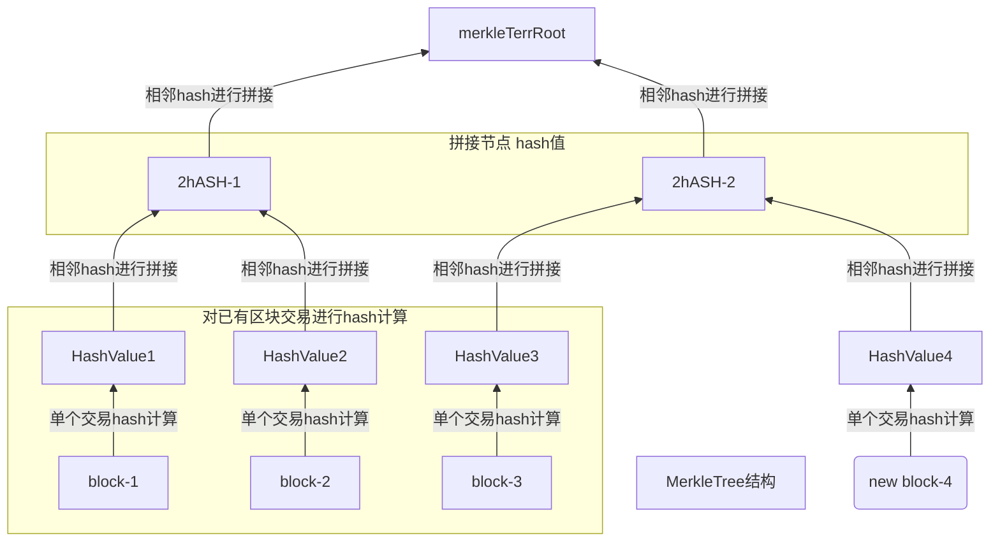

# MerkleTree
> 默克尔数 数据结构

**相关资料:**  
[以太坊官方文档——默克尔数](https://ethereum.org/zh/developers/docs/data-structures-and-encoding/patricia-merkle-trie/)  
[默克尔树解析](https://www.cnblogs.com/bonelee/p/13154709.html)

---

### MerkleTree 解决什么问题

---

| 在区块链中，Merkle 树（Merkle Tree）是一种二叉树的数结构，用于有效地验证大量数据的完整性。

### MerkelTree 结构:

---

> 这里有个需要搞清楚的问题，就是 Merkle Tree 的计算需要对所有的区块都进行 hash 计算得到 hash值，这样才能两两拼接；  
> 但是区块的数据是不变的，相同的输入就会有相同的输出，也就是说不管进行多少次hash计算，得到的 hash值 都是一样的  
> 这就造成了性能浪费的问题，那么以太坊和比特币是怎么解决这个问题的？

---

### [代码实现 Merkle Tree](./code/MerkelTree.java)

